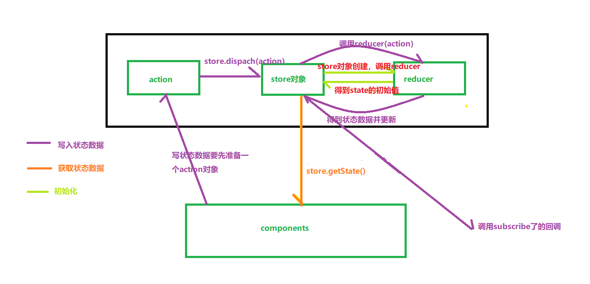
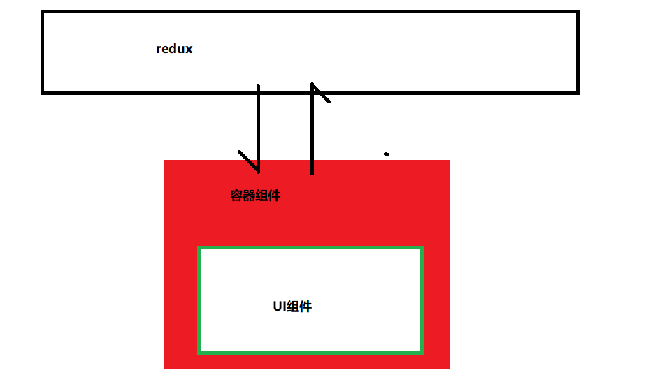
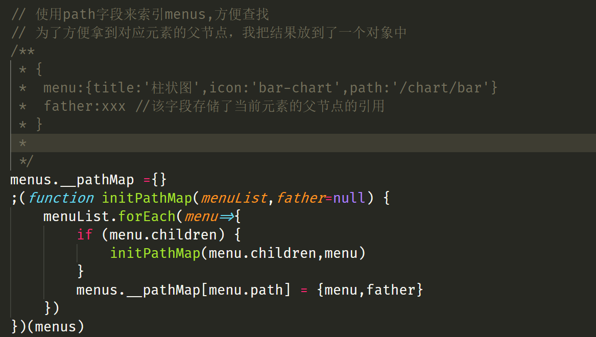
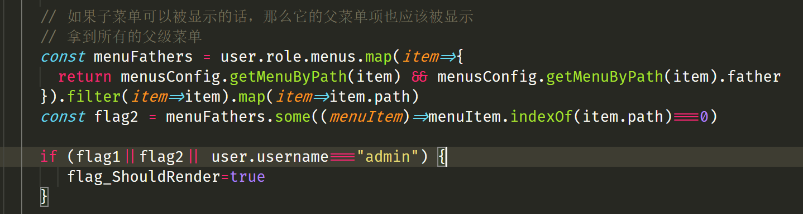
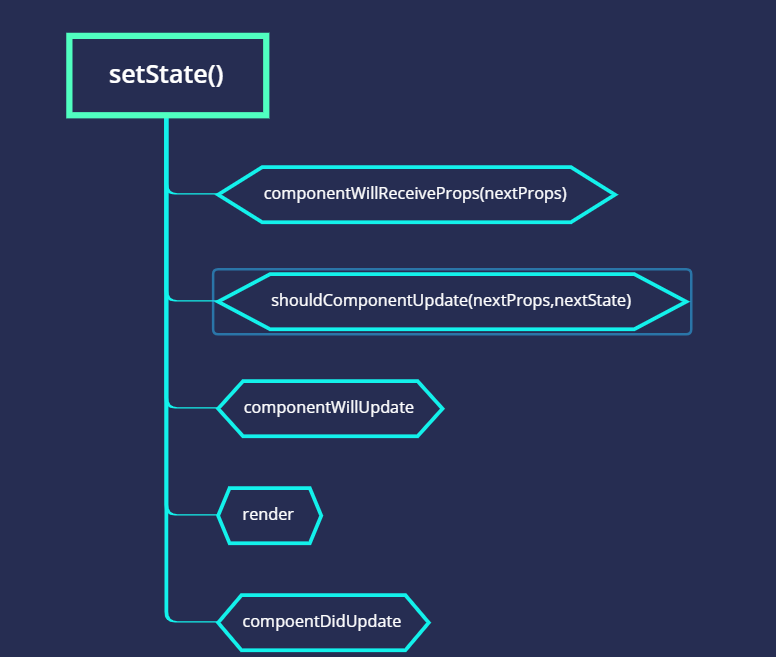
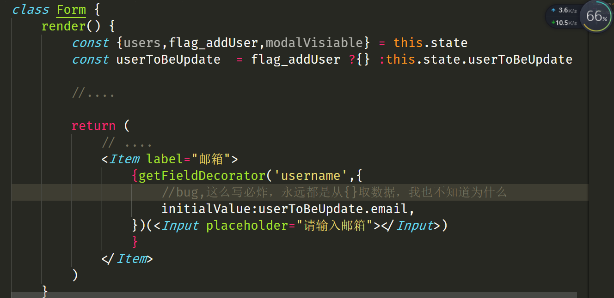
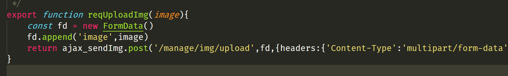

# 知识点

---

###### 纯函数：

纯函数是一个没有副作用的函数，无论在什么外部环境下，同样的输入一定可以得到同样的输出，并且函数的执行不会影响外部的环境。

一般纯函数要满足以下约束：

函数的执行不会进行I/O（磁盘，网络等）操作。

函数的执行不会修改参数中引用的内容


###### redux

redux是一个用于集中管理状态数据的一个库，他不是react的插件，也可以用于vue等需要管理状态数据的框架。

什么时候应该使用redux:

多个组件共享的状态数据，可以交由redux管理。

redux的核心概念：

1. store

   store对象中保存了要集中管理的state，同时也提供了对状态数据进行访问的接口。

   获取状态数据：store.getState()

   更新状态数据：store.dispatch(action)

2. action

   是一个对象，用于指定某个行为下的新状态数据。当调用store.dispatch(action)时，action会被送到reducer，reducer根据action中的内容返回新的状态数据到store对象中。

3. reducer(state=initValue,action)

   是一个纯函数，根据收到的action给store返回相应的state。

   第一个参数拿到的是旧的状态。

redux的工作流程图




###### react-redux

---

react-redux是react的一个插件，简化了redux在react框架下的使用

react-redux将组件分成了两类

- UI组件

  只负责数据展示，不带有任何业务逻辑

  通过props接收数据（一般数据，函数（用于设置状态数据））

  UI组件最典型的特征是没有redux相关的代码

- 容器组件

  负责业务逻辑，将数据通过props传给UI组件




**核心API**

`<Provider store={store}><App /></Provider>`

用于提供store给所有容器组件，常包在根组件上


`connect`

用于生成容器组件

```js
const container = connect(mapStateToProps,mapDispatchToProps)
const wrappedComponent = container(Component)
```


**异步anction**

---

引入redux-thunk

```js
yarn add redux-thunk

import {createStore,applyMeddileWare} from 'redux';
import {composeWithDevTools} from 'redux-devtools-extension'
import thunk from 'redux-thunk'
export default createStore(reducer, composeWithDevTools(applyMiddleware(thunk)))
```

编写异步action:

```js
export const add = number =>dispatch=>{setTiemOut(dispatch(action))}
```

 **redux-devtools-extension**

chrome的redux插件依赖于该 扩展


**合并多个reducer**

---


```js
import {combineReducers} from 'redux';

const initHeadTitle ='首页';
// reducer的名称可以看做是读取state信息时的命名空间
function headTitle(state=initHeadTitle,action) {
    switch (action.type) {
        case  SET_HEAD_TITLE:
            return action.data
        default:
            return state
    }
}
export default combineReducers({headTitle});
```

合并以后，各 reducer的名称可以看做是读取state信息时的命名空间，取的时候应该使用state.xxx来拿到xxx的state信息.


## 项目经验

在使用Menu/Tree等与树结构相关的组件时，在需要根据权限来显示菜单项的情况下，常常需要这么一个操作：“子元素的存在会激活父元素”。

套路如下

1.将父元素的引用保存到子元素中



当访问某个元素的时候查看该元素是否有父元素，有的话连同父元素一起展示




---

父组件给子组件传递了新的props时，想`通过this拿到最新的props`只能在render以及之后执行的生命周期钩子中。

可以在componentWillReceiveProps，shouldComponentUpdate中通过参数拿到最新的props

> 千万不要在willUpdate中通过this拿props，这里只能拿到旧的props

生命周期中update阶段的执行顺序如下：




## 出现的bug以及解决。



经验：要在render中渲染的数据最好都从对象中解构出来使用，而不是通过对象的引用去获取数据。


使用axios上传FormData的时候直接传FormData对象就行了，不要再包一层对象。




传入undefined给new Date() 会得到一个Invilid Date对象。


